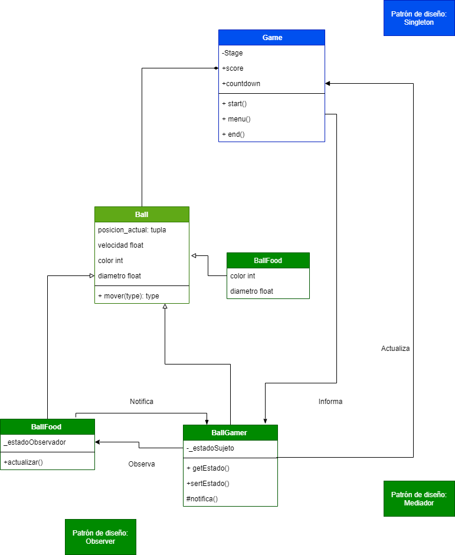
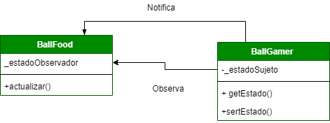
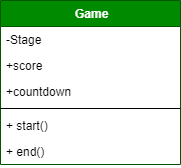
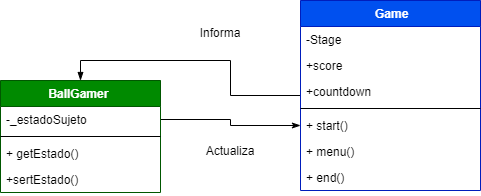

# Fat Ball o Monstruo come circulos. :basketball:
Ejemplo de aplicación de patrones de diseño a un juego muy básico.
En este juego encontramos los siguientes patrones de diseño:
## Contexto del Juego
Con esta sencilla aplicación de Javascript, te enfrentas a otros monstruos come circulos. La regla es que si tienes un tamaño mayor que el circulo con el que chocas, eres el depredador, pero si es al reves eres la presa de ese depredador. La regla es: te comes a los más pequeños que tú, pero los más grandes que tú tienen derecho a comerte. En este caso usaras las teclas para moverte.
## Código general-imagen de contexto

### Diagrama general de clases

## 1. Patrón Observer :eyes:
Observa los **cambios de estado** que tenga un **sujeto u objeto** para notificar sus suscripciones.
Para este juego el objeto **BallFood** (Bola-comida) **se suscribe a las BallGamer**(Bola del jugador).  
Este Patrón se usa para detectar la colisión, generando que se reubique BallFood (comida) y que se incremente el radio del BallGamer.
### Según esto tenemos en el código:

### Diagrama Patrón Observer

## 2. Patrón Singleton :walking:
Restringe la creación de objetos de la clase **Game**, porque hay una única clase-objeto juego. De este nos interesa el Stage o escenario.Que tiene la información de ancho, alto del cuadro de juego, la cuenta regresiva, el score, además necesitamos el inicio y finalizacion del juego.
### Según esto tenemos en el código:

### Diagrama Patrón Singleton

## 3. Patrón Mediator :speech_balloon:
Informa el score desde el mediador, que seria la clase **BallGame** a la clase **Game** para que esta presente la información.
### Según esto tenemos en el código:

### Diagrama Patrón Mediator

## Bibliografía
https://anexsoft.com/patron-observador-con-javascript-observer-pattern

## Autores

Nestor Camilo Beltrán
Edda Camila Rodríguez 

