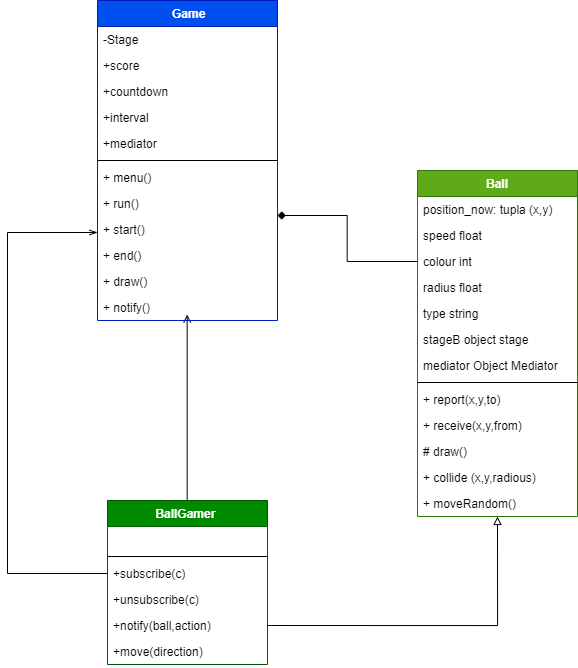

# Fat Ball o Monstruo come círculos. :basketball:
Ejemplo de aplicación de patrones de diseño a un juego muy básico.

## Contexto del Juego
Con esta sencilla aplicación de Javascript, te enfrentas a otros monstruos come circulos. La regla es que si tienes un tamaño mayor que el círculo con el que chocas, sumaras puntos, pero si es al reves te vas quedando sin radio hasta que pierdas. La regla es: te comes a los más pequeños y estáticos que tú, pero los más grandes que tú tte pueden ir disminuyendo hasta que mueras. En este caso usaras las teclas para moverte.
## Explicación general del Código e imagen de contexto
Las clases que se muestran en el gráfico estan distribuidas en un archivo js diferente. La clase que reune más información en líneas de código es game porque esta implementa los diversos patrones para que funcione el juego. Según lo anterior, primero expondremos el código del archivo ejecutable y después todos los patrones para entender este Game.js: 
```
//Created Stage
var stageFrame = new Stage('canvas', 600, 400);
//Created Game
var  game1 = new Game(stageFrame);
game1.menu();
stageFrame.context.canvas.focus();

```
### Diagrama general de clases


En este juego encontramos los siguientes patrones de diseño:
## 1. Patrón Observer :eyes:
Observa los **cambios de estado** que tenga un **sujeto u objeto** para notificar sus suscripciones.
Para este juego el objeto **BallGame** (Bola-jugador) **se suscribe al Game**(Clase que contiene score-tiempo y elementos para que funcione el juego).  
Este Patrón se usa para actualizar el puntaje-score, generando que la actualización de estya información según la interacción  y el incremento del radio del BallGamer.
### Según esto tenemos en el código:
**1.Sobre la clase BallGamer:**
```
class BallGamer extends Ball {
...

  /**
   * Set a new observer to observers
   * @param {object} c
   */
  subscribe( c ){
    this.observers.push(c);
  }
  
  /**
   * Remove observer to observers
   * @param {object} c
   */
  unsubscribe( c ) {
      this.observers = this.observers.filter(observer => observer instanceof c !== true);
  }
  
  /**
   * Set a notifiaction all  to observers
   * @param {object} ball
   * @param {string} action
   */
  notify(ball, action) {
      this.observers.forEach(observer => {
          observer.notify(ball, action);
      });
  }
 .... 
 }
```
**2.Sobre la clase Game:**
```
class Game {...
  
  /**
   * Get notification from BallGamer partten Observer
   * @param {Ball} ball
   * @param {string} acction
   * 
   */
  notify(ball, acction) {
    
    if (acction === 'add') {
      this.score++;
    } else if(acction === 'sub') {
      this.score--;
      
      if (ball.radius <= 2) {
        console.log('End');
        this.runner = false;
        setTimeout(this.end, 300);
      }
      
    }

  }
  
}
```
### Diagrama Patrón Observer



## 2. Patrón Singleton :walking:
Restringe la creación de objetos de la clase **Game**, porque hay una única clase-objeto juego. De este nos interesa el Stage o escenario.Que tiene la información de ancho, alto del cuadro de juego, la cuenta regresiva, el score, además necesitamos el inicio y finalizacion del juego.
### Según esto tenemos en el código:
**2.Sobre la clase Game:**
```
//Singlenton
class Game {
  
  /**
   * 
   * @param {Stage} stageG
   * @param {int} countdown
   * @returns {Game.constructor|Game|Game.instance}
   */
  constructor(stageG, countdown = 30) {
    this.stageG = stageG;
    this.score = 0;
    this.countdown = countdown;
    this.interval = null;
    this.mediator = null;
    
    if (typeof Game.instance === 'object') {
      return Game.instance;
    }
  
    Game.instance = this;
    
    return this;
  }
  ....
```
### Diagrama Patrón Singleton


## 3. Patrón Mediator :speech_balloon:
Comunica todas las interacciones entre **BallGamer, BallFood, BallEnemy"** a la clase **Game** para que se muestren los cambios de color, se reste el radio si hay colisión, si muere el jugador o para que aparezca más alimento **BallFood**. Para implementar esta capacidad se creo una clase **Mediator**
### Según esto tenemos en el código:
**1. Clase Mediator**
```
/**
 * Implement to pattern Mediator, for communication between all balls
 * 
 */
class Mediator {
  
  constructor() {
    this.participants = [];
  }

/**
 * Set a participant to array participats
 * @param {objet} participant
 */
  register(participant) {
      this.participants.push(participant);
      participant.mediator = this;
  }
  
  /**
 * Set many participants to array participats
 * @param {array} participants
 */
  registerMany(participants) {
    
    for ( var participant in participants) { 
      this.participants.push(participants[participant]);
      participants[participant].mediator = this;
    }
  }
  
  /**
   * Report to alll participants a message from anoter participants.
   * @param {int} x
   * @param {int} y
   * @param {Ball} from
   * @param {Ball} to
   */
  report(x, y, from, to) {
    if (to) {                      // single message
        to.receive(x, y, from);    
    } else {                       // broadcast message
      for ( var key in this.participants) {   
        if (this.participants[key] !== from) {
            this.participants[key].receive(x, y, from);
        }
      }
    }
  }
  
}
```
**2. En la clase game:
### Diagrama Patrón Mediator


## 4. Patrón FactoryMethod :speech_balloon:
Informa el score desde el mediador, que seria la clase **BallGame** a la clase **Game** para que esta presente la información.
### Según esto tenemos en el código:

### Diagrama Patrón Factory Method


## 5. Patrón Iterator :speech_balloon:
Informa el score desde el mediador, que seria la clase **BallGame** a la clase **Game** para que esta presente la información.
### Según esto tenemos en el código:

### Diagrama Patrón Iterator


## Bibliografía :green_book:
https://anexsoft.com/patron-observador-con-javascript-observer-pattern

## Autores ✒️

Edda Camila Rodrigez - 20202099033 :woman:
Néstor Camilo Beltrán - 20202099021 :older_man:
