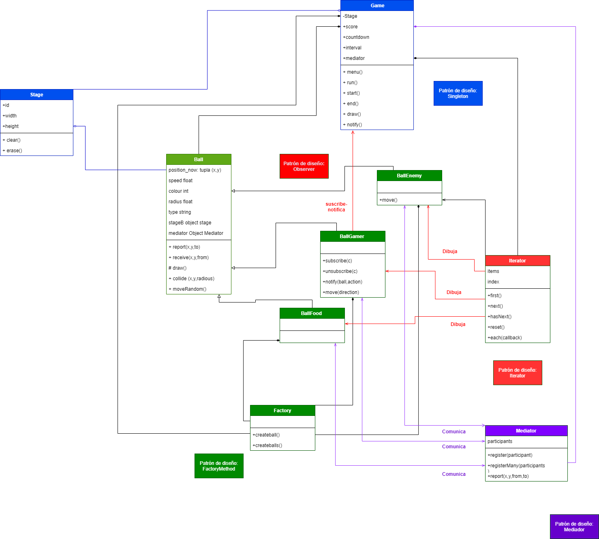
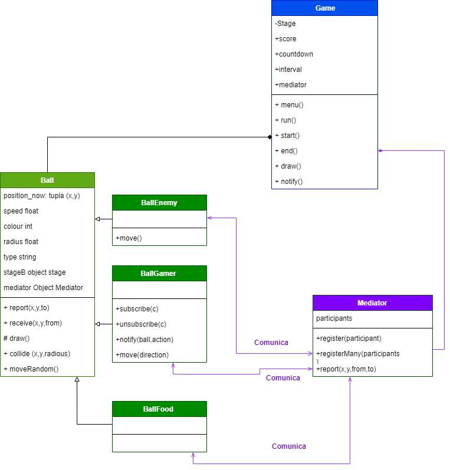

# Fat Ball o Monstruo come círculos. :basketball:
Ejemplo de aplicación de patrones de diseño a un juego muy básico.

## Contexto del Juego
Con esta sencilla aplicación de Javascript, te enfrentas a otros monstruos come circulos. La regla es que si tienes un tamaño mayor que el círculo con el que chocas, sumaras puntos, pero si es al reves te vas quedando sin radio hasta que pierdas. La regla es: te comes a los más pequeños y estáticos que tú, pero los más grandes que tú tte pueden ir disminuyendo hasta que mueras. En este caso usaras las teclas para moverte.
## Explicación general del Código e imagen de contexto
Las clases que se muestran en el gráfico estan distribuidas en un archivo js diferente. La clase que reune más información en líneas de código es game porque este implementa los diversos patrones para que funcione el juego. A continuación se enseña el código asociado a Game.js
```
//Singlenton
class Game {
  
  /**
   * 
   * @param {Stage} stageG
   * @param {int} countdown
   * @returns {Game.constructor|Game|Game.instance}
   */
  constructor(stageG, countdown = 30) {
    this.stageG = stageG;
    this.score = 0;
    this.countdown = countdown;
    this.interval = null;
    this.mediator = null;
    
    if (typeof Game.instance === 'object') {
      return Game.instance;
    }
  
    Game.instance = this;
    
    return this;
  }
  
  /**
   * Show the start menu
   * 
   */
  menu() {
    this.stageG.erase();
    this.stageG.context.fillStyle = '#000000';
    this.stageG.context.font = '36px Arial';
    this.stageG.context.textAlign = 'center';
    this.stageG.context.fillText('Fat Balls!', this.stageG.width / 2, this.stageG.height / 4);
    this.stageG.context.font = '24px Arial';
    this.stageG.context.fillText('Click to Start', this.stageG.width / 2, this.stageG.height / 2);
    this.stageG.context.font = '18px Arial';
    this.stageG.context.fillText('Use the arrow keys to move', this.stageG.width / 2, (this.stageG.height / 4) * 3);
  
    // Start the game on a click
//    this.stageG.context.canvas.addEventListener('click', this.start.bind(this), false);
    this.stageG.context.canvas.addEventListener('click', function(event) {
      event.preventDefault();
      Game.instance.start();
    });
    
  }
  
  /**
   * Run the game, valide countdown 
   * 
   */ 
  run() {
    if (Game.instance.runner === true) {
      Game.instance.stageG.erase();
      Game.instance.draw();

      Game.instance.stageG.context.fillStyle = '#000000';
      Game.instance.stageG.context.font = '18px Arial';
      Game.instance.stageG.context.textAlign = 'left';
      Game.instance.stageG.context.fillText('Score: ' + Game.instance.score, 10, 24);
      Game.instance.stageG.context.fillText('Time Remaining: ' + Game.instance.countdown, 10, 50);
    
      if (Game.instance.countdown <= 0) {
        Game.instance.end();
      } else {
        window.requestAnimationFrame(Game.instance.run);
      }
    }
  }
  
  /**
   * Start the game, in this fuction all 
   * 
   */
  start() {
    
    if (this.countdown < 30) {
      this.countdown = 30;
    }
    
    this.score = 0;
    this.stageG.clear();
    // Reduce the countdown timer ever second
    this.interval = setInterval(function() {
      Game.instance.countdown--; 
    }, 2000);
    
    // Stop listening for click events
//    console.debug(this.stageG);
//    this.stageG.context.canvas.removeEventListener('click', this.start);
    this.stageG.context.canvas.removeEventListener('click', function(event) {
//      event.preventDefault();
      Game.instance.start();
    });
    //Call class Factory
    var factory = new Factory();
    //Call class Mediator
    var mediator = new Mediator();
            
    const gamer1  = factory.createBall(this.stageG, 'gamer' );
    mediator.register(gamer1);
    gamer1.subscribe(Game.instance);
    
    var ballFoods = factory.createBalls(this.stageG, 'food', 30);
    mediator.registerMany(ballFoods);
    
    var ballEnemys = factory.createBalls(this.stageG, 'enemy', 20);
    mediator.registerMany(ballEnemys);
    
    this.mediator = mediator;
   
    this.stageG.context.canvas.addEventListener('keydown', function(event) {
      event.preventDefault();
      console.log(event.key, event.keyCode);
      gamer1.move(event.keyCode);

    }, this);

    this.runner = true;
    this.run();

  }
  
  /**
   * End the game, clear stage.
   * 
   */
  end() {
    console.debug('In The End');
	// Stop the countdown
    clearInterval(Game.instance.interval);
    // Display the final score
    Game.instance.stageG.erase();
    Game.instance.stageG.context.fillStyle = '#000000';
    Game.instance.stageG.context.font = '24px Arial';
    Game.instance.stageG.context.textAlign = 'center';
    
    if (Game.instance.score < 0){
      Game.instance.stageG.context.fillText('You lose - Fatality ', Game.instance.stageG.width / 2, Game.instance.stageG.height / 2);
    } else {
      Game.instance.stageG.context.fillText('Final Score: ' + Game.instance.score, Game.instance.stageG.width / 2, Game.instance.stageG.height / 2);
    }
  }
  
  /*
   * Draw all ball at the stage
   */
  draw() {

    var iterBalls = new Iterator(this.mediator.participants);
    
    iterBalls.each(function(ball) {
      
      if (ball.type === 'enemy') {
        ball.move();
      }
      
      ball.report(ball.x, ball.y);
      ball.draw();
    }, this);
    
  }
  
  /**
   * Get notification from BallGamer partten Observer
   * @param {Ball} ball
   * @param {string} acction
   * 
   */
  notify(ball, acction) {
    
    if (acction === 'add') {
      this.score++;
    } else if(acction === 'sub') {
      this.score--;
      
      if (ball.radius <= 2) {
        console.log('End');
        this.runner = false;
        setTimeout(this.end, 300);
      }
      
    }

  }
  
}
```
### Diagrama general de clases




En este juego encontramos los siguientes patrones de diseño:
## 1. Patrón Observer :eyes:
Observa los **cambios de estado** que tenga un **sujeto u objeto** para notificar sus suscripciones.
Para este juego el objeto **BallFood** (Bola-comida) **se suscribe a las BallGamer**(Bola del jugador).  
Este Patrón se usa para detectar la colisión, generando que se reubique BallFood (comida) y que se incremente el radio del BallGamer.
### Según esto tenemos en el código:

### Diagrama Patrón Observer


## 2. Patrón Singleton :walking:
Restringe la creación de objetos de la clase **Game**, porque hay una única clase-objeto juego. De este nos interesa el Stage o escenario.Que tiene la información de ancho, alto del cuadro de juego, la cuenta regresiva, el score, además necesitamos el inicio y finalizacion del juego.
### Según esto tenemos en el código:

### Diagrama Patrón Singleton


## 3. Patrón Mediator :speech_balloon:
Informa el score desde el mediador, que seria la clase **BallGame** a la clase **Game** para que esta presente la información.
### Según esto tenemos en el código:

### Diagrama Patrón Mediator



## 4. Patrón FactoryMethod :speech_balloon:
Informa el score desde el mediador, que seria la clase **BallGame** a la clase **Game** para que esta presente la información.
### Según esto tenemos en el código:

### Diagrama Patrón Factory Method


## 5. Patrón Iterator :speech_balloon:
Informa el score desde el mediador, que seria la clase **BallGame** a la clase **Game** para que esta presente la información.
### Según esto tenemos en el código:

### Diagrama Patrón Iterator


## Bibliografía :green_book:
https://anexsoft.com/patron-observador-con-javascript-observer-pattern

## Autores ✒️

Edda Camila Rodrigez - 20202099033 :woman:
Néstor Camilo Beltrán - 20202099021 :older_man:
